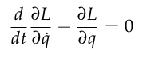
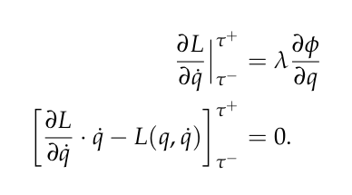

# Physics Simulator Die and Box

### Demo video

    <video src="Demo.mp4" controls></video>

## Task
We were tasked with programming a physics simulator with collision from scratch in python. 

### Frames
For this simulation I kept track of the location of 4 frames on the die's corners, and 4 on the edges of the box the die was in. Using this frames I was able to check if the corners of the jack intersected the box at each time interval, meaning I should simulate a collision.

### Lagrangian Dynamics
The dynamics of the system were simulated using the Euler-Lagrange equations of motion shown below.

    

Once a collision was detected, the equations below were used to determine the location and speed of the colliding objects the time instance directly after the collision. 

    

With these sets of equations and the frame definitions from before, the simulation could be run with arbitrary starting points and velocities.

### External forces
The box that the die was contained in had its own mass and was affected by gravity, thus there was a need to apply an external upward force to keep the box at the same y level and make the simulation easier to demonstrate. 